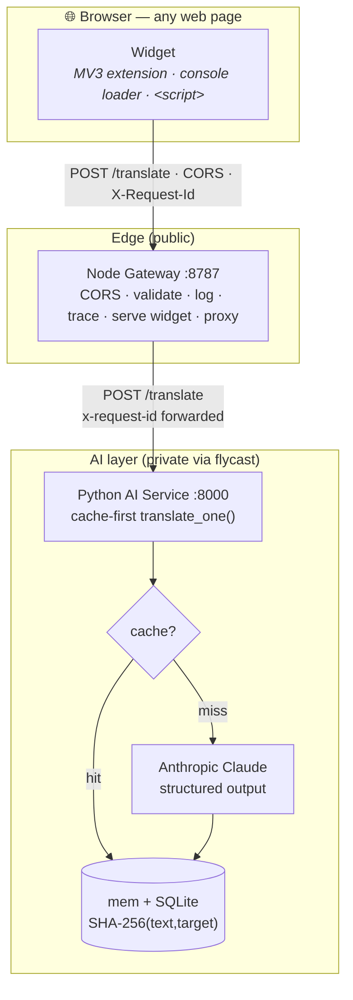
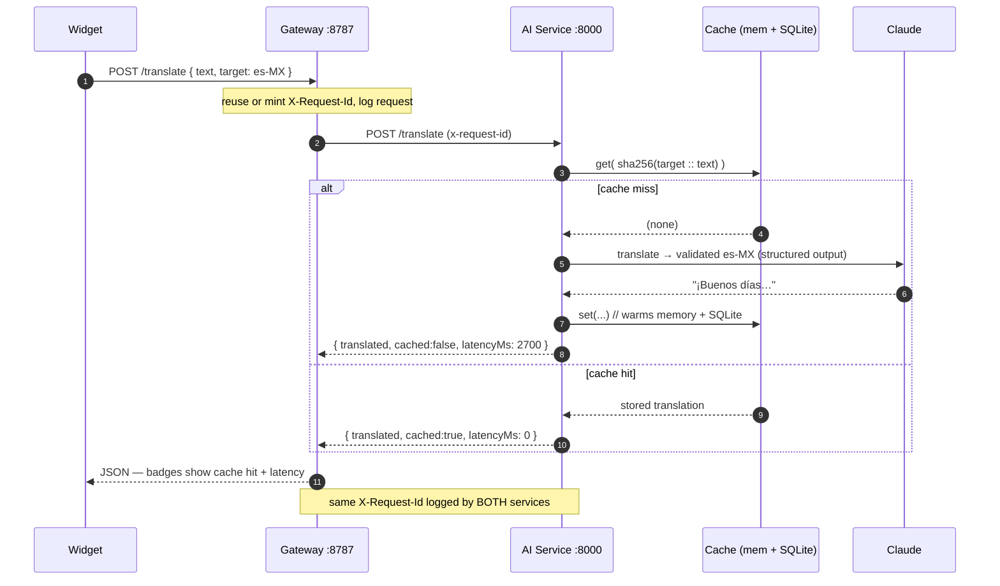

<div align="center">

# 🌐 Glosa — Live Translate

**Translate any English web page into natural Mexican Spanish, in real time, on any site you don't control — backed by a two-service LLM API with a two-tier cache.**


</div>

Glosa drops a floating **Translate** button onto any page. Click **Translate page** and the whole page flips to natural Mexican Spanish; click **Restore** to bring the English back. It ships three ways off a single widget — a **Chrome extension** (whose background worker bypasses strict-CSP sites), a **DevTools console snippet**, and a **gateway-served `<script>`** — and it's proven against real, third-party sites it doesn't control (homedepot.com, GitHub, Google).

Behind the widget are two independently-deployable services: a **Node/Express gateway** (browser-facing: CORS, validation, logging, request tracing) and a **Python/FastAPI AI service** (the LLM call, a two-tier cache, and structured logs). API keys never touch the browser edge.

> Most page translators flatten tone, register, and idiom into literal, phrase-level output. Glosa treats translation as a **product and a systems problem** — get the *register* right (real es-MX, not generic Spanish), keep it **fast and cheap** with an aggressive cache, make it **observable and reliable**, and make it **actually run on pages you don't own**.

---

## Table of contents

- [Highlights](#highlights)
- [Measured performance](#measured-performance)
- [Architecture](#architecture)
- [How a translation flows](#how-a-translation-flows)
- [Under the hood — engineering decisions](#under-the-hood--engineering-decisions)
- [Tech stack](#tech-stack)
- [The API contract](#the-api-contract)
- [Getting started](#getting-started)
- [Deploy](#deploy)
- [Quality & benchmarks](#quality--benchmarks)
- [Repository layout](#repository-layout)
- [Roadmap](#roadmap)
- [What this project demonstrates](#what-this-project-demonstrates)
- [About the author](#about-the-author)
- [License](#license)

---

## Highlights

- **🗣️ Register-aware LLM translation** into **es-MX** — natural Mexican Spanish (`usted`, local vocabulary), not generic/Castilian Spanish. Numbers, prices, and product/SKU codes are preserved verbatim (`DeWalt DCD771C2`, `$99.00` stay intact).
- **⚡ Two-tier cache** (in-memory dict + SQLite, SHA-256 keyed) — identical text **never hits the LLM twice**; a cache hit is **~300× faster** than a miss and the SQLite tier **survives a restart**.
- **🛡️ Fail-loud by design** — a provider error surfaces as `502`; the service **never** serves untranslated English as if it succeeded. (This guards against a real, shipped-in-the-wild failure mode: a silent `except` returning the input.)
- **🔎 Observable** — one structured JSON log line per request and per translation, correlated **end-to-end across both services** by a single `X-Request-Id`.
- **📊 Proven, not eyeballed** — a zero-dependency benchmark enforces a latency/throughput/cost **SLA** and exits non-zero on breach (drops straight into CI).
- **🌍 Works on real sites** — the MV3 extension's background worker proxies requests, so translation works even on **strict-CSP** sites where injected scripts are blocked.
- **🚀 Deployed** — both services run on **Fly.io**; the gateway is public, the AI service is private over `flycast`, with a volume-backed SQLite cache.

---

## Measured performance

End-to-end through the **deployed** gateway (cold cache, benchmark workload):

| Metric | Result | SLA | |
|---|---:|---:|:--:|
| Cache hit p95 | **7.6 ms** | ≤ 60 ms | ✅ |
| Cache miss p95 | **2969 ms** | ≤ 3500 ms | ✅ |
| Cache hit rate | **77.5 %** | ≥ 60 % | ✅ |
| Throughput (warm) | **1622 req/s** | ≥ 20 | ✅ |
| Error rate | **0.0 %** | ≤ 1 % | ✅ |
| Cost / cache miss | **~$0.0002** | — | — |

**On a live Home Depot page**, re-translating the same 12 real strings dropped from **16.7 s → 819 ms** with all 12 served from cache — the cache demonstrably works against uncontrolled, real-world content. Full write-up in [`PRODUCT_EVAL.md`](PRODUCT_EVAL.md).

---

## Architecture

Three moving parts: a browser frontend and two backend services, split so that browser-facing concerns and AI concerns scale, deploy, and fail **independently** — and so API keys never live on a browser-reachable edge.



**Why two services?** CORS, validation, asset serving, rate limiting, and request logs are genuinely different concerns from prompts, model choice, caching, and API-key custody. Splitting them keeps secrets off the edge and lets each side fail without taking the other down.

---

## How a translation flows

The response's `cached` flag and `latencyMs` are surfaced to the user as live badges — a UI hook straight into the backend's cache.



---

## Under the hood — engineering decisions

The interesting parts aren't "it calls an LLM" — they're the production choices around it.

<details>
<summary><b>Two-tier cache with a deterministic key</b></summary>

Cache keys are `SHA-256("{target}::{text}")` — deterministic, collision-safe, and independent of request order. A read checks the **in-memory dict** first (instant), then **SQLite** (survives restarts), and only then calls the LLM. A disk hit **warms** the memory tier; a miss writes through to both. An upsert bumps an `access_count` while preserving `created_at`, and `/stats` exposes memory-hits / db-hits / misses / hit-rate. Net effect: identical `(text, target)` is **never** paid for twice, and a page you've seen before re-translates in milliseconds.
</details>

<details>
<summary><b>Fail-loud LLM — no silent English passthrough</b></summary>

A tempting bug is to wrap the model call in `try/except` and return the original text on failure. That ships a "translator" that silently serves English while looking healthy. Glosa refuses it: any provider/SDK/validation error **propagates**, the gateway returns `502`, and the failure is logged. Correctness is observable, not assumed.
</details>

<details>
<summary><b>Structured, validated model output</b></summary>

The Anthropic SDK is patched with <a href="https://github.com/567-labs/instructor"><code>instructor</code></a> so the model returns a validated Pydantic <code>Translation</code> object instead of raw text — the call site gets a typed value, and malformed output is a caught error, not a downstream surprise.
</details>

<details>
<summary><b>A prompt library, not a prompt string</b></summary>

Prompts live in <code>lib/prompts.yaml</code> and render through Jinja2 with <code>StrictUndefined</code>. Each locale declares its <i>register</i>, <i>formality</i>, and language-specific notes (es-MX uses <code>usted</code>, never <code>vosotros</code>; MSA for Arabic keeps Latin tokens LTR; etc.). Adding a language is a YAML edit — the codebase already ships config for **10 locales**.
</details>

<details>
<summary><b>Distributed tracing with one header</b></summary>

The gateway reuses an inbound <code>X-Request-Id</code> or mints a UUID, logs it, and forwards it to the AI service, which logs the same id on its translation line. One request is greppable **end-to-end across both services** — the foundation of real observability, kept deliberately minimal.
</details>

<details>
<summary><b>Shipping into a hostile environment (the forward-deployed part)</b></summary>

Real pages fight back: strict CSP blocks injected scripts, host CSS leaks in, and the DOM is adversarial. Glosa's widget uses a max <code>z-index</code>, a scoped class namespace, an idempotent load guard, light/dark theming, reduced-motion and a11y support — and the MV3 extension's background worker proxies requests so translation works even where console injection is blocked. It walks text nodes with a <code>TreeWalker</code> (skipping <code>script</code>/<code>style</code>/editable fields), swaps in place, and keeps a map of originals for instant, lossless restore.
</details>

<details>
<summary><b>An executable SLA + cost model</b></summary>

<code>benchmark/bench.py</code> (standard library only) fires a realistic mixed workload, measures p50/p95 for hits vs misses, warm throughput, hit rate, and error rate, and projects monthly cost <b>with vs. without</b> the cache. It <b>exits non-zero on any SLA breach</b>, so "fast enough and cheap enough" is enforced, not hoped for.
</details>

---

## Tech stack

| Layer | Tech |
|---|---|
| **Frontend** | Vanilla JS widget (zero deps), **Chrome Manifest V3** extension (content script + background worker + popup), console loader |
| **Gateway** | **Node.js** + **Express**, `cors`, `dotenv`, global `fetch` (Node 18+) |
| **AI service** | **Python 3.14** + **FastAPI** + `uvicorn`, `pydantic`, `instructor`, `aiosqlite`, Jinja2 |
| **LLM** | **Anthropic Claude** (provider-swappable), structured output |
| **Storage** | SQLite (persistent cache) + in-memory dict |
| **Infra** | **Docker**, **Fly.io** (public gateway + private `flycast` AI service, volume-backed cache) |
| **Quality** | Stdlib benchmark + SLA gate, evaluation harness, live-website test |

---

## The API contract

The widget speaks this to the **Node gateway**, which forwards the same shapes to the **Python AI service**.

```jsonc
// POST /translate
// →
{ "text": "Good morning, welcome!", "target": "es-MX" }
// ←
{ "translated": "¡Buenos días, bienvenido!", "cached": false, "latencyMs": 812, "model": "claude-sonnet-4-6" }
```

```jsonc
// POST /translate/batch   (used by "Translate page")
{ "texts": ["Home", "Best sellers", "Add to cart"], "target": "es-MX" }
// ←
{ "results": [ { "translated": "Inicio", "cached": true }, /* … */ ], "latencyMs": 40 }
```

```jsonc
// GET /health → { "status": "ok", "model": "…", "cacheSize": 128 }
// GET /stats  → { "requests": 40, "memory_hits": 22, "db_hits": 6, "misses": 12, "hit_rate_pct": 70.0 }
```

**Invariants:** `cached` is `true` *only* on a cache hit (no LLM call); `latencyMs` is measured server-side on both paths; errors return JSON with a sensible status (`400` bad input · `502` upstream failure · `501` not implemented).

---

## Getting started

Two services, two terminals. Start the AI service first (testable with `curl`, no browser needed), then the gateway, then load the widget.

**1 — Python AI service**
```bash
cd backend/ai-service-python
python -m venv .venv && source .venv/bin/activate
pip install -r requirements.txt
cp .env.example .env            # add ANTHROPIC_API_KEY (and optionally MODEL=claude-sonnet-5)
uvicorn app:app --port 8000
```

**2 — Node gateway**
```bash
cd backend/gateway-node
npm install
cp .env.example .env            # AI_SERVICE_URL defaults to http://localhost:8000
npm start                       # http://localhost:8787
```

**3 — Load the widget**
- **Extension (recommended, required for real sites):** `chrome://extensions` → Developer mode → *Load unpacked* → `extension/`. Set the backend URL in the popup.
- **Console (permissive pages):** DevTools → Console → paste `loader/console-snippet.js`.
- **Demo page:** open `demo-pages/index.html` and uncomment the `<script src=".../widget.js">` line.

Click the **Translate** button (bottom-right) → **Translate page** → the page flips to Mexican Spanish. Hit **Restore**, then **Translate** again → the badges show **cache hits** and latency drops to near-zero.

---

## Deploy

Both services run on [Fly.io](https://fly.io) — the gateway public, the AI service private over `flycast`. Condensed (full runbook in [`DEPLOY.md`](DEPLOY.md)):

```bash
# AI service (private)
cd backend/ai-service-python && fly launch --no-deploy
fly secrets set ANTHROPIC_API_KEY=...          # never baked into the image
fly deploy

# Gateway (public) — built from repo root so it can serve widget/
cd .. && fly launch --no-deploy --config backend/gateway-node/fly.toml
fly secrets set AI_SERVICE_URL=http://<your-ai-app>.flycast
fly deploy --config backend/gateway-node/fly.toml .
```

Point the extension popup at the public gateway URL and translate a real site.

---

## Quality & benchmarks

```bash
python benchmark/bench.py                # end-to-end through the gateway; exits non-zero on SLA breach
python benchmark/bench.py --direct       # straight to the AI service (:8000)
python eval/eval.py                      # contract + cache + SLA + tracing checks → eval/REPORT.md
```

- **`benchmark/`** — the SLA gate + latency/throughput/cost model.
- **`eval/`** — automated checks over the contract, cache persistence, observability (including cross-service trace correlation), and status codes.
- **`PRODUCT_EVAL.md`** — an evidence-first product evaluation, including the live-website test.

---

## Repository layout

```
glosa/
├─ widget/            # the translation widget (canonical, zero-dependency)
├─ extension/         # Chrome MV3 extension (bundles the widget + a copy)
├─ loader/            # DevTools console loader
├─ demo-pages/        # a local page to test on
├─ backend/
│  ├─ gateway-node/       # Node/Express gateway  (:8787, public)
│  └─ ai-service-python/  # FastAPI AI service    (:8000, private)
│     └─ lib/             # cache · llm · prompts(.yaml) · logger
├─ benchmark/         # bench.py + sla.json (SLA gate)
├─ eval/              # eval.py + criteria.json (quality checks)
├─ DEPLOY.md          # Fly.io runbook
└─ PRODUCT_EVAL.md    # product evaluation report
```

---

## Roadmap

- **Docker Compose** — `docker compose up` runs the whole stack locally.
- **Rate limiting** on the gateway (per-IP `429` + a friendly widget message).
- **Streaming** long translations token-by-token into the widget.
- **Cache TTL / invalidation** and a `POST /clear-cache` endpoint.
- **Language picker** in the widget/popup (es-ES, pt-BR, ja…) threaded through the contract — the prompt library already ships config for 10 locales.
- **Beyond DOM text** — an OCR/overlay pass to reach text rasterized into images (the one coverage gap on real retail pages).

---

## What this project demonstrates

A compact but complete slice of production engineering — the practices it exercises:

- **Full-stack delivery** — browser (MV3 extension + injected widget) → Node/Express edge → Python/FastAPI service, over a clean HTTP contract.
- **Applied AI / LLM engineering** — register-specific prompt design, structured/validated output, provider abstraction, and **fail-loud reliability** instead of silent wrong answers.
- **Systems & performance** — a two-tier cache with a real hit-rate strategy, latency **SLAs**, load benchmarking, and a **cost model** tied to cache efficiency.
- **Observability** — structured logging and **distributed tracing** correlated across service boundaries.
- **DevOps** — containerization, Fly.io deploys, private service networking, and secret hygiene (keys never on the edge).
- **Forward-deployed product thinking** — it ships into environments I don't control (real third-party sites, strict CSP), and it's judged by an **honest evaluation**, not a happy-path demo.

---

## About the author

**Taimoor Raza** — a **full-stack + applied-AI engineer** with a **forward-deployed mindset**: I like taking a capability (here, an LLM) and making it work *in the real, messy environment where users actually are* — end to end, from the browser to the model to the deploy, with the caching, observability, and reliability that make it hold up in production.

Glosa is a small system that leans into that: a product that has to run on pages I don't own, meet a latency/cost SLA, fail loudly, and prove itself against a live website — not just a notebook.

- **GitHub:** [@tr049](https://github.com/tr049)
- **Email:** [taimoor.raza7@gmail.com](mailto:taimoor.raza7@gmail.com)

Questions, feedback, and ideas about the project are welcome.

---

## License

MIT © 2026 Taimoor Raza — see [`LICENSE.md`](LICENSE.md).
